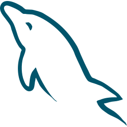
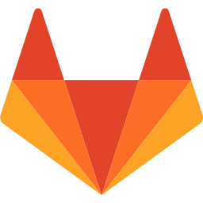

# Hello, I'm Ederson O Pravtz

- 🖥️ Currently studying web development with javascript
- 🚀 Aiming to become a excellent full-stack programmer
- 💡 I believe that with good ideas and willpower it is possible to transform the world
- ❤️ Coding its my passion

## Main Stacks

    
    
    
    
    
    
    
    
    
    

 

## My Repositories

    
    
    

 

## Social Midia

    
    
    

 

## Posts

- [5 Dicas para melhorar a performance em aplicações React Native](https://www.instagram.com/p/CpTdC_4OU9G/?utm_source=ig_web_copy_link)
- [3 Coisas que eu acho que fazem o React brilhar](https://www.instagram.com/p/CpU73YVOp_-/?utm_source=ig_web_copy_link)
- [Redux VS React Context](https://www.instagram.com/p/CpX1DQNufO-/?utm_source=ig_web_copy_link)
- [Boas práticas em desenvolvimento de sistemas web](https://www.instagram.com/p/CpfbLXWuOe3/?utm_source=ig_web_copy_link)

## My currently published projects

- [**cli-bitcoin**](https://www.npmjs.com/package/cli-bitcoin) => that brings information via the command line of the cryptocurrency world.
- [**App-tour**](https://github.com/pravtz/app-tour) => Tourism application that shows photos of the most visited places in Porto Alegre

## contact

    <a href="mailto:ederson.ufrgs@gmail.com">ederson.ufrgs@gmail.com</a>

